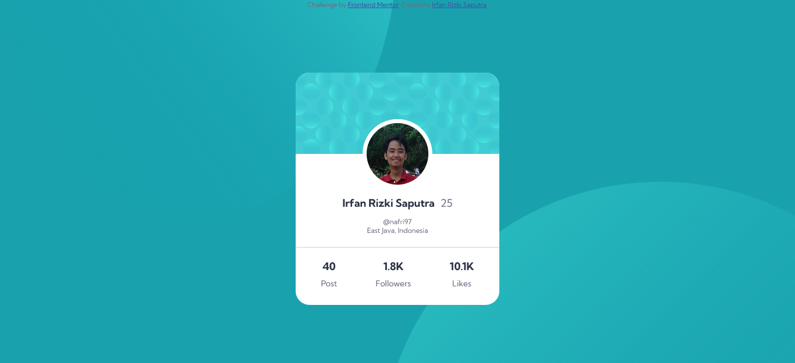
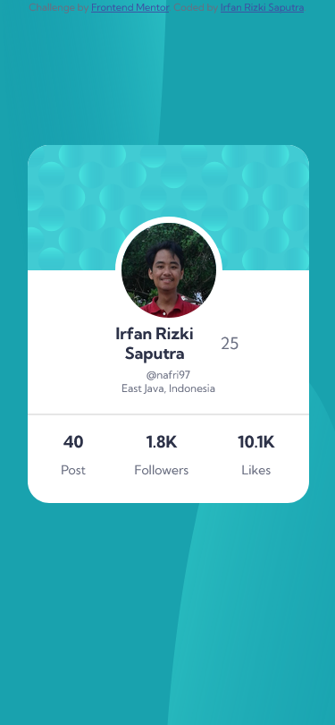

# Frontend Mentor - Profile card component solution

This is a solution to the [Profile card component challenge on Frontend Mentor](https://www.frontendmentor.io/challenges/profile-card-component-cfArpWshJ). Frontend Mentor challenges help you improve your coding skills by building realistic projects. 

## Table of contents

- [Overview](#overview)
  - [Screenshot](#screenshot)
  - [Links](#links)
- [My process](#my-process)
  - [Built with](#built-with)
  - [What I learned](#what-i-learned)
  - [Continued development](#continued-development)
  - [Useful resources](#useful-resources)
- [Author](#author)

## Overview

### The challenge

- Build out the project to the designs provided

### Screenshot




### Links

- Solution URL: [Github Repository](https://github.com/nafri97/profile-card)
- Live Site URL: [Github Pages](https://nafri97.github.io/profile-card)

## My process

### Built with

- Semantic HTML5 markup
- CSS custom properties
- Flexbox
- CSS Bootstrap

### What I learned

It is some insight that I just learned, see below:

```css
body{
    width: 100%;
    height: 100vh;
    background: 
    url('images/bg-pattern-top.svg') right top / 50% 150% no-repeat, 
    url('images/bg-pattern-bottom.svg') right bottom / 70% 150% no-repeat,
    hsl(185, 75%, 39%);
    background-position: left top -90vh, right -60% bottom -100vh, center;
    object-fit: fill;
    position: relative;}
```
that code allow to use background with multiple image with different treat each. but I still little bit confuse to combine with position, width, and height.

```html
<a class="ig"href="https://www.instagram.com/" target="_blank">@nafri97</a>
```target="_blank" is use to move to new page instead of directly open page.

### Continued development

  this code I wasn't know how to using .js or .json so in the future i will learn them after I mastered enough using css.

### Useful resources

- [W3school](https://www.w3schools.com) - this helped me which code I decide to use.
- [chatGPT](https://www.chat.openai.com) - this is amazing it could fix my code (altough sometime its code doesn't work as i wanted)
- [Bootstrap](https://www.getbootstrap.com) - this is useful to help my flex box, because I frequeent stuck in flexbox responsiveness whe I make my own.

## Author

- Github - [nafri97](https://gihub.com/nafri97)
- Frontend Mentor - [@nafri97](https://www.frontendmentor.io/profile/nafri97)
- Twitter - [@irfanrizkis](https://www.twitter.com/irfanrizkis)
